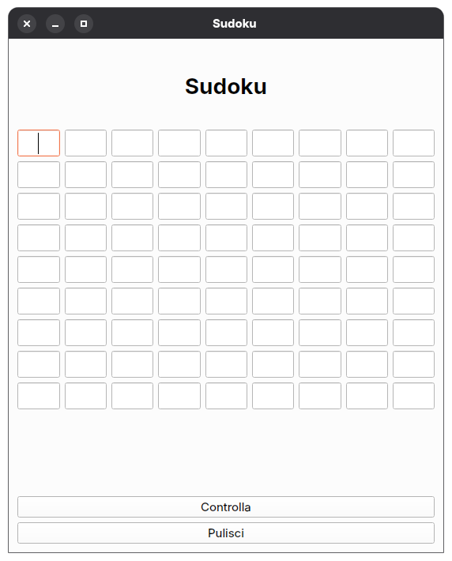
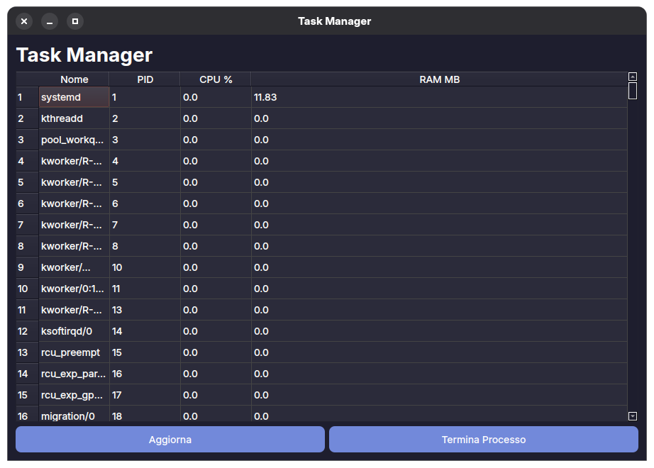

# Progetto-Study-PyQt6
hi my name is Daniele i'am from italy, i'm tryng to create someting innovative, and for now there are 4 app, they're sperimental, but i'm working on them daily, for now this four app are the most simple app whit the UI basic of the PyQt6, i whant to create more app, and learn at the best the PyQt6 function.
- one is a calculator and is a basic calculator whith the basic function of the calculator in future add the sientific calculator function

- the second one is a sudoku, is a simple app for play sudoku, the UI is preaty besic but i whant to upgrade it in the next week

- the third one is, a sperimental app, whit more than one page, and is just to learn how to create some pages.

- the fourth is a system monitor app, and you can kill processes too, for now it have a basic graphic, in the future i whant to upgrade the UI, and the function to add more, for now is preaty basic, you can modify too 

